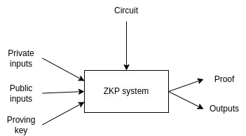
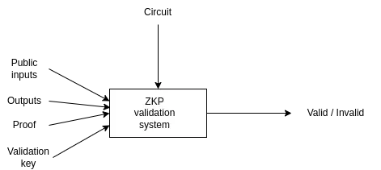

# ZK Drop

### 目标

- 本次将开发一个隐私空投的应用zkdrop，通过使用zk的方式保护接收空投者的隐私
- 使用circom技术栈，从0到1开发zkapp，讲解背后的开发和部署流程

### 开发ZK APP，有哪些技术栈可以选择？

- circom   [Start Here](https://docs.circom.io/)
- snarky.js  [zkapps for mina](https://zkappsformina.com/)  / [how to](https://docs.minaprotocol.com/zkapps/how-to-write-a-zkapp)
- Aleo   [Leo - Aleo guide](https://developer.aleo.org/getting_started)  / [awesome aleo](https://github.com/howardwu/awesome-aleo)
- Noir  [awesome Noir](https://github.com/noir-lang/awesome-noir)  / [Noir guide](https://docs.aztec.network/developers/noir)
- Halo2, libsnark … …

### 选择circom的利弊权衡

- 开发难度
- 产品生态
- JS/wasm支持
- evm支持

### zkdrop的思路

思路：[miro board](https://miro.com/app/board/uXjVOCOM9cg=/?invite_link_id=79946175165)

（教程主要参考 [zeko](https://github.com/enricobottazzi/Zeko) 和 [a16z zkp merkle airdrop](https://github.com/a16z/zkp-merkle-airdrop-contracts)，做了一些修改以支持最新的circom和snarkjs）

### 流程

1. 编写和编译电路 

`circom circuits/circuit.circom --sym --wasm --r1cs -o ./build`

2. 可信初始化，生成proving key和validation key

`snarkjs plonk setup build/circuit.r1cs build/powersOfTau28_hez_final_16.ptau build/circuit_final.zkey`

3. 通过电路生成链上验证的智能合约 MerkVerifier.sol

`snarkjs zkey export solidityverifier build/circuit_final.zkey contracts/compiled/MerkVerifier.sol`

4. 部署智能合约：NFT合约、空投合约、verifier合约

`npx hardhat run ./scripts/4_deployContracts.ts --network localhost`

5. 将一部分NFT转给空投合约

`npx hardhat run ./scripts/5_mint721.ts --network localhost`

6. 提交白名单，更新MerkleTree

`npx hardhat run ./scripts/6_collectCommitments.ts --network localhost`

7. 客户端生成证明

`npx hardhat run ./scripts/7_GenerateProofCallData.ts --network localhost`

8. 线上验证，领取空投

`npx hardhat run ./scripts/8_collect721.ts --network localhost`

### 生成证明与验证的过程

生成证明的过程:

验证的过程:

### zkapp on gitcoin

- zk投票，使用Semaphore认证在一组人中的会员资格并且阻止双重投票 [gitcoin](https://gitcoin.co/grants/7822/zero-voting-a-privacy-focused-voting-system)
- zk nullifier，改进semaphore这类nullifier的算法安全性并且和钱包集成  [gitcoin](https://gitcoin.co/grants/7638/zk-nullifiers-new-cryptography-for-sybil-resistan)
- aztec bot，检测地址是否将要攻击或者洗钱，作者专门写监测机器人服务  [gitcoin](https://gitcoin.co/grants/7322/forta-bots-funding-money-laundering-through-aztec)
- zk form，使用circom来证明成员资格并完成问卷，不会泄露个人身份  [gitcoin](https://gitcoin.co/grants/7223/zkforms-proof-of-humanity)
- zk ml，把模型的执行过程变为电路，验证私有数据在模型上的结果 [gitcoin](https://gitcoin.co/grants/4847/zkml)
- zk map，在电子围栏中但又不透露具体的地址 [gitcoin](https://gitcoin.co/grants/5781/zkmaps-proof-of-location)  [gitcoin](https://gitcoin.co/grants/5613/zk-locale-privacy-preserving-proof-of-presence)
- zk battleship，使用零知识证明的游戏 [gitcoin](https://gitcoin.co/grants/5397/battlezips-v2-zero-knowledge-state-channel-battle)
- zk reddit，匿名的小组成员资格并发帖  [gitcoin](https://gitcoin.co/grants/5133/zk-reddit)
- zksnark repl，在线写circom和调试  [gitcoin](https://gitcoin.co/grants/5121/zkrepl-an-online-playground-for-zero-knowledge-ci)
- otter cash，solana上的tornado cash  [gitcoin](https://gitcoin.co/grants/5013/otter-cash-cheap-zk-on-solana)
- zk 的常用代码模板，有年龄验证，对比 proof，匿名投票   [gitcoin](https://gitcoin.co/grants/4858/zk-block-boilerplate-tools-to-bootstrap-zk-dapps)
- zk 做数据市场， [gitcoin](https://gitcoin.co/grants/4850/zk-data-marketplace)
- 用 python 实现 zk 的过程， https://github.com/ZeroProphet/klefki

### zkapp winning projects on 2022 hackthons

**ethindia**

- [https://devfolio.co/projects/zk-kyc-fc8e](https://devfolio.co/projects/zk-kyc-fc8e)
- [https://devfolio.co/projects/interplanetary-compute-system-49d9](https://devfolio.co/projects/interplanetary-compute-system-49d9)
- [https://devfolio.co/projects/zkfundraise-0c40](https://devfolio.co/projects/zkfundraise-0c40)
- [https://devfolio.co/projects/banana-smart-wallet-efca](https://devfolio.co/projects/banana-smart-wallet-efca)

**ethglobal**

- [https://ethglobal.com/showcase/zkauth-zgdq7](https://ethglobal.com/showcase/zkauth-zgdq7)   使用 2fa 进行 aa 验证

**ethsf**

- [https://ethglobal.com/showcase/zkooter-skjn1](https://ethglobal.com/showcase/zkooter-skjn1)
- [https://ethglobal.com/showcase/zk-section-9-9ce2n](https://ethglobal.com/showcase/zk-section-9-9ce2n)
- [https://ethglobal.com/showcase/zkbluebird-c421b](https://ethglobal.com/showcase/zkbluebird-c421b)
- [https://ethglobal.com/showcase/onchain-zk-shuffle-texas-holdem-wuc8u](https://ethglobal.com/showcase/onchain-zk-shuffle-texas-holdem-wuc8u)
- [https://ethglobal.com/showcase/zk-stablecoin-engine-nbshq](https://ethglobal.com/showcase/zk-stablecoin-engine-nbshq)

**ethbogota**

- [https://ethglobal.com/showcase/zk-vote-9ipgt](https://ethglobal.com/showcase/zk-vote-9ipgt)
- [https://ethglobal.com/showcase/zk-nullifier-snap-6a9sq](https://ethglobal.com/showcase/zk-nullifier-snap-6a9sq) 在 mm 中生成符合某种规则的 nullifier 来支持匿名投票和论坛（这种可以实现真正的无server匿名化） 它来源于 nons dao 的讨论
- [https://ethglobal.com/showcase/zkvoice-fighting-plutocrat-dao-communities-ptrzp](https://ethglobal.com/showcase/zkvoice-fighting-plutocrat-dao-communities-ptrzp)
- [https://ethglobal.com/showcase/zkzak-tkbum](https://ethglobal.com/showcase/zkzak-tkbum)  符合条件即可加入的匿名创作者平台
- [https://ethglobal.com/showcase/zkvaccination-3mzzj](https://ethglobal.com/showcase/zkvaccination-3mzzj)